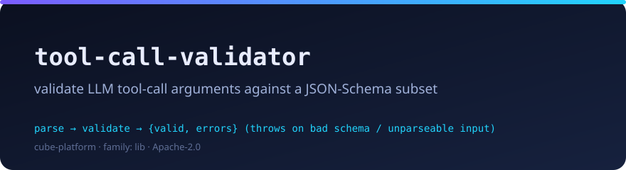

# tool-call-validator

<p align="center"></p>

*Validate an LLM tool/function call's JSON arguments against the tool's declared JSON-Schema-subset; throws on malformed schema or input.*

[](../INDEX.md)
[](./package.json)
[](./LICENSE)

## Overview

When an LLM emits a tool/function call, you get a tool **name** and a JSON
**arguments** payload — and the JSON quality is variable (trailing commas,
single-quoted strings, unquoted keys, wrapped in ` ```json … ``` `, prose
around it, smart quotes). Before you hand those arguments to the tool you want
to know two things: did it parse, and does it match the tool's declared
parameter schema?

`tool-call-validator` is a small, **zero-dependency** library that does exactly
this, in two layers:

1. **Lenient parse** (`parseJsonLoose`) — tries strict `JSON.parse`, then
   extracts the first JSON object/array from surrounding prose, then repairs
   common LLM mistakes.
2. **Schema validation** (`validate`) — checks a parsed value against a
   **JSON-Schema subset** and returns a path-tagged verdict.

`parseAndValidate` chains both: pass the raw model output + the tool's schema,
get back a validated typed value or a structured error report.

The schema subset covers `type`
(`string`/`number`/`integer`/`boolean`/`object`/`array`/`null`, with `integer`
distinct from `number`), `properties`, `required`, `items`, `enum`,
`minimum`/`maximum`, `minLength`/`maxLength`, `pattern`, and
`additionalProperties: false`. Deliberately **out of scope**:
`oneOf`/`anyOf`/`allOf`, `$ref`, `format`, custom keywords — for a full JSON
Schema engine use Ajv; for *just enough* to pin down LLM outputs, this is enough.

The library is **pure and deterministic**: no network, no filesystem, no clock,
no randomness — so there are **no seams, no fakes, and no live-check**.
Everything runs offline.

**Validation verdict vs. throw.** A *failed validation* — missing required
field, wrong type, unknown property — is a **verdict** (`{ valid: false,
errors }`), the correct, expected result. A genuine *usage error* — a malformed
schema, a non-string argument payload, or input that cannot be parsed even
after repair — **throws** `SchemaError`. The library never silent-empties on
bad input.

## Usage

Runs on [Bun](https://bun.sh) directly from source — no build step.

```sh
bun test          # the suite (pure functions — deterministic, offline)
bunx tsc --noEmit # typecheck
```

### A valid tool call passes

```ts
import { parseAndValidate, type Schema } from "tool-call-validator";

const getWeather = {
  type: "object",
  properties: {
    location: { type: "string", minLength: 1 },
    units: { enum: ["c", "f"] },
  },
  required: ["location"],
} as const satisfies Schema;

// Even when the model wraps the JSON in prose, a fence, and bad quoting:
const raw = "Sure! Here:\n```json\n{ location: 'Bucharest', units: 'c', }\n```";

const r = parseAndValidate(raw, getWeather);
if (r.valid) {
  // r.value === { location: "Bucharest", units: "c" }
  // callWeatherTool(r.value)
}
```

### An invalid call → `{ valid: false, errors }` (a verdict, not a throw)

```ts
import { parseAndValidate } from "tool-call-validator";

const schema = {
  type: "object",
  properties: { id: { type: "integer" } },
  required: ["id"],
  additionalProperties: false, // reject unknown keys
} as const;

const r = parseAndValidate('{"name": "oops", "extra": 1}', schema);
// r.valid === false
// r.errors includes  { path: "id", message: "required" }
//               and  { path: "extra", message: "unknown property" }
if (!r.valid) {
  // Feed the path-tagged errors back to the LLM for a retry:
  const feedback = r.errors.map((e) => `${e.path}: ${e.message}`).join("\n");
}
```

### A malformed schema / unparseable input throws

```ts
import { parseAndValidate, validate, SchemaError } from "tool-call-validator";

// 1) A malformed schema is a usage error, not a passing validation:
try {
  // @ts-expect-error — "frobnicate" is not a valid type
  validate({ a: 1 }, { type: "frobnicate" });
} catch (err) {
  console.log(err instanceof SchemaError); // true
}

// 2) Arguments that cannot be parsed even after lenient repair throw too:
try {
  parseAndValidate("this is definitely not json", { type: "object" });
} catch (err) {
  console.log(err instanceof SchemaError); // true — surfaced, not swallowed
}
```

## Part of the Cube Platform

A `lib`-family cube — a zero-dep tool-call validation micro-library. See the
workspace [INDEX.md](../INDEX.md) for sibling cubes.

---

Apache-2.0 · Vlad Bordei &lt;vlad@vollko.com&gt; · https://github.com/p-vbordei
